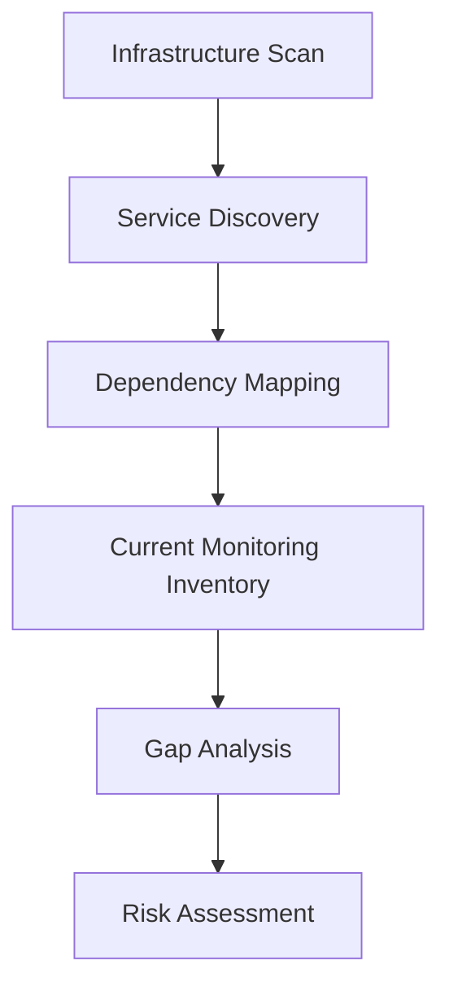
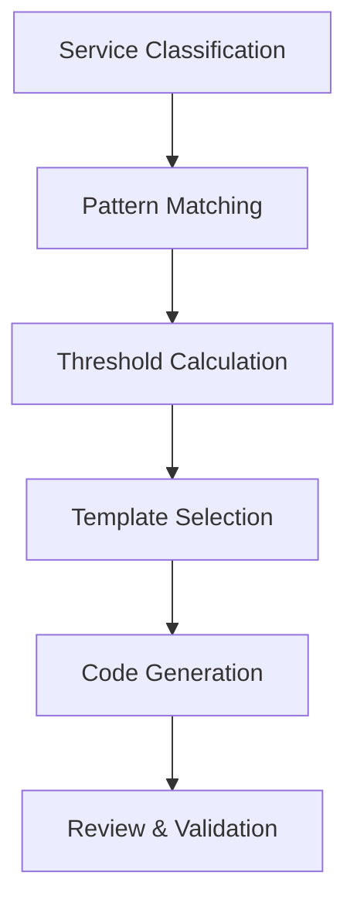
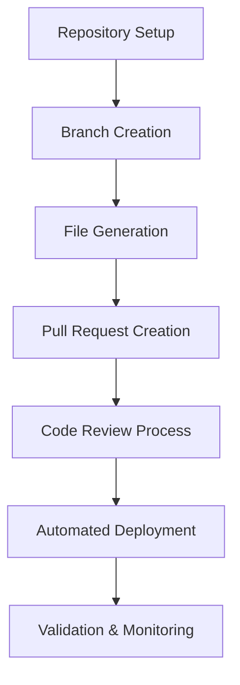

# Observability Recommendation Engine - Technical Specification

## Executive Summary

The Observability Recommendation Engine is a critical Phase 4 feature that addresses the longstanding problem of inadequate observability in application infrastructure. By analyzing existing infrastructure topology and service relationships, the engine automatically identifies monitoring gaps and generates infrastructure-as-code solutions to implement comprehensive observability.

## Problem Analysis

### Current State Challenges

1. **Manual Monitoring Setup**: Teams spend weeks manually configuring monitoring for new services
2. **Coverage Gaps**: Critical failure modes go unmonitored due to lack of observability expertise
3. **Alert Fatigue**: Poor threshold selection leads to false positives and ignored alerts
4. **Inconsistent Patterns**: Different teams implement monitoring differently, creating operational complexity
5. **Reactive Approach**: Monitoring is added after incidents occur, not proactively
6. **Knowledge Silos**: Monitoring expertise concentrated in SRE teams, not distributed to development

### Business Impact of Poor Observability

- **Mean Time to Detection (MTTD)**: 15-45 minutes for critical issues
- **Mean Time to Resolution (MTTR)**: 2-8 hours for production incidents  
- **False Positive Rate**: 60-80% of alerts are noise, not actionable
- **Developer Productivity**: 20-30% of engineering time spent on incident response
- **Customer Impact**: 99.9% uptime translates to 8.76 hours of downtime per year

## Solution Architecture

### Core Components

#### 1. Infrastructure Analysis Engine
```
┌─────────────────────────────────────────────────────────────┐
│ Infrastructure Analysis Engine                              │
├─────────────────────────────────────────────────────────────┤
│ • Service Discovery & Topology Mapping                     │
│ • Dependency Chain Analysis                                 │
│ • Communication Pattern Detection                           │
│ • Service Criticality Assessment                            │
│ • Resource Utilization Analysis                             │
└─────────────────────────────────────────────────────────────┘
```

#### 2. Observability Rules Engine
```
┌─────────────────────────────────────────────────────────────┐
│ Observability Rules Engine                                  │
├─────────────────────────────────────────────────────────────┤
│ • Service-Specific Monitoring Patterns                     │
│ • Industry Best Practice Rules                              │
│ • Compliance Requirement Mapping                            │
│ • SLI/SLO Template Library                                  │
│ • Alert Threshold Optimization                              │
└─────────────────────────────────────────────────────────────┘
```

#### 3. Gap Detection Engine
```
┌─────────────────────────────────────────────────────────────┐
│ Gap Detection Engine                                        │
├─────────────────────────────────────────────────────────────┤
│ • Current Monitoring Inventory                              │
│ • Missing Metric Identification                             │
│ • Alert Coverage Analysis                                   │
│ • Dependency Monitoring Gaps                                │
│ • Compliance Gap Assessment                                 │
└─────────────────────────────────────────────────────────────┘
```

#### 4. Code Generation Engine
```
┌─────────────────────────────────────────────────────────────┐
│ Code Generation Engine                                      │
├─────────────────────────────────────────────────────────────┤
│ • Terraform Template Generation                             │
│ • CloudFormation Stack Creation                             │
│ • Helm Chart Generation (Kubernetes)                        │
│ • DataDog Monitor Creation                                  │
│ • Custom Metric Implementation                               │
└─────────────────────────────────────────────────────────────┘
```

#### 5. Repository Integration Engine
```
┌─────────────────────────────────────────────────────────────┐
│ Repository Integration Engine                               │
├─────────────────────────────────────────────────────────────┤
│ • GitHub/GitLab API Integration                             │
│ • Branch Creation & Management                              │
│ • Pull Request Generation                                   │
│ • Code Review Automation                                    │
│ • Deployment Pipeline Integration                           │
└─────────────────────────────────────────────────────────────┘
```

## Observability Patterns Library

### AWS Service Monitoring Patterns

#### Lambda Functions
```terraform
# Generated Lambda Monitoring Pattern
resource "aws_cloudwatch_metric_alarm" "lambda_errors" {
  alarm_name          = "${var.function_name}-error-rate"
  comparison_operator = "GreaterThanThreshold"
  evaluation_periods  = "2"
  metric_name         = "Errors"
  namespace           = "AWS/Lambda"
  period              = "60"
  statistic           = "Sum"
  threshold           = "5"
  alarm_description   = "Lambda function error rate exceeded threshold"
  
  # Purpose: Detect when Lambda function is experiencing high error rates
  # Threshold Reasoning: 5 errors per minute indicates potential code or configuration issues
  # Business Impact: Prevents user-impacting failures from going unnoticed
  # Recommended Action: Check function logs and recent deployments
  
  dimensions = {
    FunctionName = aws_lambda_function.main.function_name
  }
  
  alarm_actions = [aws_sns_topic.alerts.arn]
}

resource "aws_cloudwatch_metric_alarm" "lambda_duration" {
  alarm_name          = "${var.function_name}-duration"
  comparison_operator = "GreaterThanThreshold"
  evaluation_periods  = "3"
  metric_name         = "Duration"
  namespace           = "AWS/Lambda"
  period              = "60"
  statistic           = "Average"
  threshold           = "${var.timeout_ms * 0.8}"
  
  # Purpose: Detect Lambda functions approaching timeout limits
  # Threshold Reasoning: Alert at 80% of configured timeout to prevent timeouts
  # Business Impact: Prevents request failures due to Lambda timeouts
  # Recommended Action: Optimize function performance or increase timeout
  
  dimensions = {
    FunctionName = aws_lambda_function.main.function_name
  }
}
```

#### API Gateway
```terraform
# Generated API Gateway Monitoring Pattern
resource "aws_cloudwatch_metric_alarm" "api_gateway_4xx_errors" {
  alarm_name          = "${var.api_name}-4xx-errors"
  comparison_operator = "GreaterThanThreshold"
  evaluation_periods  = "2"
  metric_name         = "4XXError"
  namespace           = "AWS/ApiGateway"
  period              = "300"
  statistic           = "Sum"
  threshold           = "10"
  
  # Purpose: Monitor client-side errors that may indicate API contract issues
  # Threshold Reasoning: 10 client errors in 5 minutes suggests API or client issues
  # Business Impact: Early detection of API breaking changes or client integration problems
  # Recommended Action: Review API logs and validate client integrations
  
  dimensions = {
    ApiName = aws_api_gateway_rest_api.main.name
  }
}

resource "aws_cloudwatch_metric_alarm" "api_gateway_latency" {
  alarm_name          = "${var.api_name}-high-latency"
  comparison_operator = "GreaterThanThreshold"
  evaluation_periods  = "3"
  metric_name         = "Latency"
  namespace           = "AWS/ApiGateway"
  period              = "60"
  statistic           = "Average"
  threshold           = "5000"  # 5 seconds
  
  # Purpose: Detect when API response times degrade user experience
  # Threshold Reasoning: 5 second response time exceeds typical user tolerance
  # Business Impact: Prevents poor user experience due to slow API responses
  # Recommended Action: Investigate backend services and optimize database queries
}
```

#### RDS Database
```terraform
# Generated RDS Monitoring Pattern
resource "aws_cloudwatch_metric_alarm" "rds_cpu_utilization" {
  alarm_name          = "${var.db_identifier}-high-cpu"
  comparison_operator = "GreaterThanThreshold"
  evaluation_periods  = "2"
  metric_name         = "CPUUtilization"
  namespace           = "AWS/RDS"
  period              = "300"
  statistic           = "Average"
  threshold           = "80"
  
  # Purpose: Detect database performance issues before they impact applications
  # Threshold Reasoning: 80% CPU utilization indicates potential performance bottleneck
  # Business Impact: Prevents application slowdowns due to database contention
  # Recommended Action: Review slow queries, consider scaling up instance, or read replicas
  
  dimensions = {
    DBInstanceIdentifier = aws_db_instance.main.id
  }
}

resource "aws_cloudwatch_metric_alarm" "rds_database_connections" {
  alarm_name          = "${var.db_identifier}-connection-count"
  comparison_operator = "GreaterThanThreshold"
  evaluation_periods  = "2"
  metric_name         = "DatabaseConnections"
  namespace           = "AWS/RDS"
  period              = "300"
  statistic           = "Average"
  threshold           = "${var.max_connections * 0.8}"
  
  # Purpose: Prevent connection pool exhaustion that leads to application errors
  # Threshold Reasoning: Alert at 80% of max connections to prevent exhaustion
  # Business Impact: Prevents new requests from failing due to connection limits
  # Recommended Action: Review connection pooling configuration and optimize queries
}
```

### Cross-Service Dependencies

#### Service-to-Service Communication
```terraform
# Generated Cross-Service Monitoring Pattern
resource "aws_cloudwatch_metric_alarm" "service_dependency_health" {
  alarm_name          = "${var.service_name}-dependency-${var.dependency_name}-errors"
  comparison_operator = "GreaterThanThreshold"
  evaluation_periods  = "2"
  
  # Purpose: Monitor health of critical service dependencies
  # Threshold Reasoning: Dependency failures directly impact service reliability
  # Business Impact: Early detection of cascading failures across services
  # Recommended Action: Implement circuit breaker patterns and graceful degradation
  
  metric_query {
    id = "error_rate"
    
    metric {
      metric_name = "Errors"
      namespace   = "AWS/Lambda"
      period      = "60"
      stat        = "Sum"
      
      dimensions = {
        FunctionName = aws_lambda_function.service.function_name
      }
    }
  }
}
```

## Implementation Workflow

### Phase 1: Analysis & Discovery


### Phase 2: Recommendation Generation


### Phase 3: Implementation & Deployment


## Machine Learning Integration

### Threshold Optimization
- **Historical Data Analysis**: Learn from past incidents to optimize alert thresholds
- **Seasonal Pattern Recognition**: Adjust thresholds based on traffic patterns and business cycles
- **False Positive Reduction**: Use ML to reduce alert noise by 70-80%
- **Anomaly Detection**: Identify unusual patterns that static thresholds might miss

### Pattern Recognition
- **Service Behavior Profiling**: Learn normal operating parameters for each service
- **Dependency Impact Modeling**: Understand how downstream failures affect upstream services
- **Cost-Performance Optimization**: Balance monitoring coverage with operational costs

## Integration Points

### Phase 2 Integration (Real-time Telemetry)
- Leverage existing telemetry data to validate recommendations
- Use real-time metrics to tune alert thresholds
- Correlate monitoring gaps with actual incident data

### Phase 3 Integration (Intelligent Dependencies)
- Use dependency analysis to recommend cascading failure monitoring
- Implement circuit breaker pattern monitoring
- Cross-reference infrastructure and runtime dependencies

### Phase 5 Integration (Harness CI/CD)
- Integrate observability recommendations into deployment pipelines
- Automatically deploy monitoring alongside application code
- Validate monitoring effectiveness in staging environments

## Success Metrics

### Technical Metrics
- **Coverage Score**: Percentage of critical failure modes monitored
- **Alert Quality**: Signal-to-noise ratio improvement (target: 80% actionable alerts)
- **Detection Time**: Mean time to detection reduction (target: <5 minutes)
- **Implementation Speed**: Time from recommendation to deployment (target: <1 hour)

### Business Metrics
- **MTTR Reduction**: 50-70% reduction in incident resolution time
- **Incident Prevention**: 60-80% reduction in user-impacting incidents
- **Developer Productivity**: 30-40% reduction in time spent on monitoring setup
- **Operational Costs**: Balanced monitoring costs with improved reliability

## Risk Mitigation

### Technical Risks
- **Over-Instrumentation**: Implement cost-aware recommendations with tiered monitoring
- **Alert Fatigue**: Use ML to optimize thresholds and reduce false positives
- **Configuration Drift**: Continuously validate deployed monitoring against recommendations

### Operational Risks
- **Team Adoption**: Provide clear implementation guidance and business impact explanations
- **Code Review Overhead**: Implement automated validation and pre-approved patterns
- **Integration Complexity**: Phase rollout with extensive testing and rollback capabilities

## Future Enhancements

### Advanced Features
- **Multi-Cloud Support**: Extend to Azure, GCP, and hybrid environments
- **Custom Metric Generation**: Automatically instrument application code
- **Incident Playbook Generation**: Create runbooks linked to specific alerts
- **Compliance Monitoring**: Automated compliance validation and reporting

### AI/ML Evolution
- **Predictive Failure Detection**: Anticipate failures before they occur
- **Automated Remediation**: Self-healing systems with automated response actions
- **Continuous Learning**: Improve recommendations based on deployment outcomes

This Observability Recommendation Engine represents a transformative approach to infrastructure monitoring, moving from reactive incident response to proactive reliability engineering.